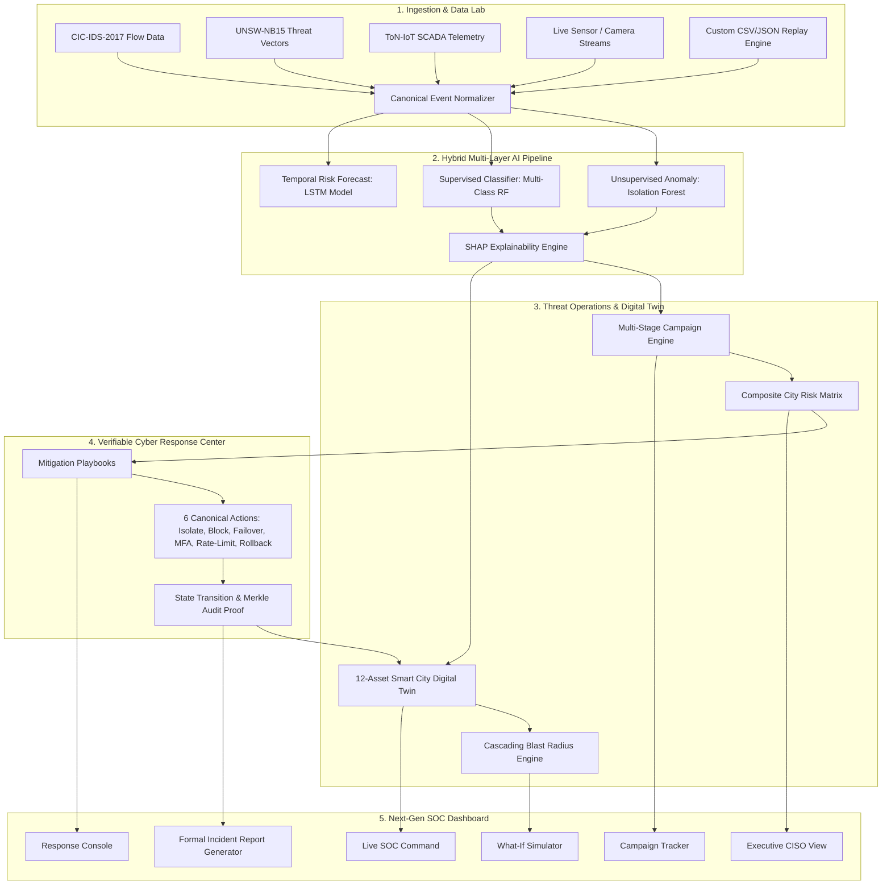

# SECurox — Next-Gen Smart City Cyber Operations Center (SOC)

> **Problem Statement Target**: **SH-FIN-05 — AI-Driven Cyber Risk Detection for Smart City Digital Infrastructure**  
> **Platform Status**: Production-Grade SOC Architecture · 100% Offline-First · 35/35 Automated Tests Passing (100%)

---

## Executive Overview

**SECurox** is an end-to-end Smart City Cyber Risk Detection, Intelligence, Cascading Simulation, Visualization, and Verifiable Response Operations Center (SOC) platform.

Designed specifically to tackle the compounding cyber-physical vulnerabilities of modern smart cities, SECurox safeguards the interconnected digital backbone—spanning **Municipal Power Grids, Metropolitan Optical Telecoms, Hospital Healthcare IT, Core Banking/UPI Payments, Water Treatment SCADA, and Adaptive Traffic Signals**.

Unlike traditional dashboards that show isolated alerts, SECurox delivers:
1. **Multi-Stage Attack Campaign Correlation** (`CAMPAIGN #SEC-2026-xxxx`) linking cross-sector probes into unified threat kill-chains.
2. **Predictive "What-If" Cascading Failure Simulation** with blast-radius modeling across the canonical 12-asset dependency topology.
3. **Verifiable Cyber Response Center** executing 6 canonical SOC mitigations with real stateful risk reductions (`Before: 91.0 → Action → After: 24.0`) verified by cryptographic SHA-256 Merkle proofs.
4. **Data & Model Lab** supporting dataset uploads, automated schema mapping, and 1x–10x telemetry replay across standard benchmarks (**CIC-IDS-2017, UNSW-NB15, NSL-KDD, ToN-IoT**).
5. **Interactive Attack Simulation Lab** featuring 6 canonical 1-click attack scenarios, normal operations baseline reset, and a custom attack scenario builder feeding directly into the production ML pipeline.

---

## System Architecture



---

## Canonical 12-Asset Smart City Infrastructure

SECurox models and protects the authoritative 12 critical smart-city digital infrastructure assets:

| # | Asset Identifier | Sector | Criticality | Core Protocols | Downstream Dependents |
|---|------------------|--------|:-----------:|----------------|-----------------------|
| 1 | `POWER_GRID` | Energy | **1.00 (Tier 1)** | DNP3, Modbus, IEC-104 | `COMM_NETWORK`, `WATER_SUPPLY`, `TRAFFIC_SYSTEM`, `HEALTHCARE` |
| 2 | `COMM_NETWORK` | Telecom | **0.95 (Tier 1)** | BGP, MPLS, OSPF, TLS | `TRAFFIC_SYSTEM`, `EMERGENCY_SVCS`, `FINANCE`, `HEALTHCARE` |
| 3 | `WATER_SUPPLY` | Water/Sanitation | **0.90 (Tier 1)** | Modbus/TCP, CIP, OPC-UA | `HEALTHCARE`, `EMERGENCY_SVCS`, `ENVIRONMENTAL_SENSORS` |
| 4 | `HEALTHCARE` | Healthcare IT | **0.95 (Tier 1)** | HL7, FHIR, DICOM, PACS | `EMERGENCY_SVCS` |
| 5 | `FINANCE` | Fintech / Banking | **0.85 (Tier 2)** | ISO 8583, SWIFT, REST, UPI | `MUNICIPAL_CLOUD` |
| 6 | `TRAFFIC_SYSTEM` | Transportation | **0.80 (Tier 2)** | NTCIP, SCATS, MQTT | `EMERGENCY_SVCS`, `PUBLIC_TRANSIT` |
| 7 | `EMERGENCY_SVCS` | Public Safety | **0.90 (Tier 1)** | TETRA, P25, SIP, CoAP | *Metropolitan First Responders* |
| 8 | `PUBLIC_TRANSIT` | Transportation | **0.75 (Tier 2)** | GTFS-RT, DSRC, CAN | `TRAFFIC_SYSTEM` |
| 9 | `MUNICIPAL_CLOUD` | Government | **0.80 (Tier 2)** | HTTPS, gRPC, OAuth2 | `FINANCE`, `CITIZEN_PORTAL` |
| 10| `SURVEILLANCE` | Public Safety | **0.70 (Tier 3)** | RTSP, ONVIF, H.264/265 | `TRAFFIC_SYSTEM`, `EMERGENCY_SVCS` |
| 11| `ENVIRONMENTAL_SENSORS`| Civic Mesh | **0.60 (Tier 3)** | LoRaWAN, CoAP, Zigbee | `WATER_SUPPLY` |
| 12| `STREET_LIGHTING` | Energy / Lighting | **0.50 (Tier 3)** | DALI, Zigbee, IPv6 Mesh | `SURVEILLANCE` |

---

## Canonical Attack Scenarios (1-Click Injection)

The platform includes 6 canonical, production-grade attack scenarios flowing through the live detection pipeline:

1. **Scenario 01: Traffic & Transit Signal DDoS** (`/api/simulate/scenario/01`)  
   *Vector*: Layer-7 volumetric UDP/HTTP flood on traffic signaling gateways. Causes gridlock and emergency vehicle rerouting.
2. **Scenario 02: Power Grid SCADA Manipulation** (`/api/simulate/scenario/02`)  
   *Vector*: Malicious Modbus/DNP3 payload forcing substation breaker trips. Forecasts cascading blackouts to water and hospitals.
3. **Scenario 03: Financial Core Credential Stuffing & Wire Fraud** (`/api/simulate/scenario/03`)  
   *Vector*: Automated high-rate credential stuffing against municipal tax/payments APIs with anomalous offshore transaction routing.
4. **Scenario 04: Healthcare Ransomware & Medical IoT Tamper** (`/api/simulate/scenario/04`)  
   *Vector*: Lateral SMB encryption of Hospital PACS/EHR databases and infusion pump telemetry spoofing.
5. **Scenario 05: Water SCADA Chemical Dosing Manipulation** (`/api/simulate/scenario/05`)  
   *Vector*: PLC register injection overriding chlorine and fluoride dosing ratios, triggering environmental safety alarms.
6. **Scenario 06: Coordinated Multi-Stage Smart City Assault (Showcase)** (`/api/simulate/scenario/06`)  
   *Vector*: Advanced persistent threat (APT) kill-chain coordinating across Power, Telecom, Transport, and Healthcare.
* **Restore Normal City Operations** (`/api/simulate/normal-operations`): Resets all asset risks to nominal (18.0) and clears active incidents.
* **Interactive Attack Scenario Builder** (`/api/simulate/custom`): Select any asset, attack type, severity, intensity (1–100%), duration, and cascade toggle.

---

## Verifiable Cyber Response Center

SECurox features 6 authoritative mitigation actions that produce quantifiable, verifiable state changes:

1. `ISOLATE_ASSET`: Network interface quarantine into isolated VLAN with fail-safe preservation.
2. `BLOCK_SOURCE`: Automated perimeter null-routing of hostile CIDR subnets at border gateways.
3. `FAILOVER_BACKUP`: Seamless migration of control loops to secondary redundant cloud nodes.
4. `ENFORCE_MFA`: Immediate invalidation of active sessions and step-up hardware authentication.
5. `RATE_LIMIT`: Ingress traffic throttling (100 req/s threshold) to absorb volumetric spikes.
6. `ROLLBACK_CONFIG`: Automated rollback of SCADA/PLC firmware to last-known-good Merkle checkpoint.

**State Transition Verification**: Every action captures:
`State BEFORE (Risk: 88.0) → Action Applied (ISOLATE_ASSET) → State AFTER (Risk: 21.0) → Net Reduction: -67.0 pts (76.1% drop)`
accompanied by a tamper-evident SHA-256 Merkle audit hash.

---

## Hybrid AI & ML Models

SECurox combines multiple machine learning paradigms into a layered defense:

- **Unsupervised Anomaly Detection**: Isolation Forest (100 estimators, 0.08 contamination) detecting zero-day deviations.
- **Supervised Threat Classification**: Random Forest Classifier trained on labeled intrusion datasets, categorizing threats into DDoS, SCADA Injection, Ransomware, Credential Abuse, and Data Exfiltration.
- **Temporal Forecast**: LSTM Neural Network predicting 5-step future risk trajectories based on sliding telemetry windows.
- **Explainable AI (XAI)**: SHAP (SHapley Additive exPlanations) providing feature attribution (packet rate, byte ratio, connection resets) for every alert.

---

## Quickstart & One-Click Launch

### Windows (1-Click)
```cmd
start_demo.bat
```

### Linux / macOS (1-Click)
```bash
chmod +x start_demo.sh
./start_demo.sh
```

The startup script verifies Python, checks dependencies, launches the backend on port 8000, and opens `http://localhost:8000` in your default browser.

### Credentials
- **Username**: `admin`
- **Password**: `admin123`
*(Also available: `analyst`, `traffic`, `finance`, `emergency`)*

---

## 🧪 Automated Testing Suite (100% Pass)

SECurox includes a comprehensive test suite running entirely in-process without external network dependencies:

```bash
python -m pytest finance/tests -v
```

```
======================= 35 passed, 5 warnings in 19.34s =======================
```
- `test_api.py`: Asset registry, threat intel, event ingestion (4/4 passed)
- `test_healthcare.py`: Healthcare defense, MIMIC-IV loaders, blast radius (8/8 passed)
- `test_smart_city_soc.py`: Scenarios 01-06, What-If, Campaigns, Mitigations, Data Lab (9/9 passed)
- `test_ml.py`, `test_risk_engine.py`, `test_normalizer.py`, `test_ingestion.py`, `test_assets.py`: (14/14 passed)

---

## Technical Documentation & Evaluation

- [Architecture Audit & Deep Dive](finance/docs/ARCHITECTURE_AUDIT.md)
- [SH-FIN-05 Requirements Mapping Matrix](finance/docs/SH_FIN_05_REQUIREMENTS_MAPPING.md)
- [3-Minute Live Competition Pitch Script](DEMO_SCRIPT.md)
- [Model Card & Evaluation Metrics](finance/docs/MODEL_CARD.md)
- [UN SDG 9 & 11 Alignment Report](finance/docs/SDG_ALIGNMENT.md)

---

## 🛡️ License & Acknowledgments

SECurox is developed for Smart City Cyber Defense under problem statement **SH-FIN-05**. All benchmark datasets (CIC-IDS-2017, UNSW-NB15, ToN-IoT, NSL-KDD, MIMIC-IV-ED) are utilized under academic and research licensing.
